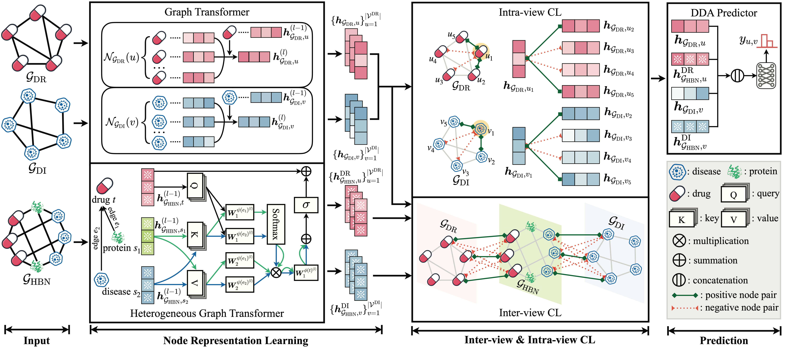

# paper_MICLE

This is the PyTorch implementation for paper "Multi-view Contrastive Learning for Drug Repositioning on Heterogeneous Biological Networks".

## Introduction
This paper presents a novel Multi-view Contrastive Learning method for identifying underlying DDAs on biological networks (abbreviated as MICLE). MICLE consists of four crucial components, i.e., node representation learning, interview CL, intra-view CL and DDA predictor. The primary innovations lie in the effective characterization of graph heterogeneity and the design of two complementary CL objectives. To the best of our knowledge, it is the first time that graph heterogeneity is sufficiently characterized in the GCL paradigm devised for DDA prediction without resort to stochastic perturbation augmentation.

## Requirements:
-  Python 3.8.19
-  cudatoolkit 11.5
-  pytorch 1.10.0
-  dgl 0.9.1
-  networkx 3.1
-  numpy 1.24.3
-  scikit-learn 1.3.0

## Usage:
- Download the datasets from [google drive](https://drive.google.com/drive/folders/1w9orlSgM_HlwGwaVWPLYgRqbjdQc7RCv)

- Creat a folder "Dataset"

- Move the downloaded datasets to the "Dataset" folder

- Execute python main.py --dataset = ["B-datset" or "C-dataset" or "F-dataset"]
